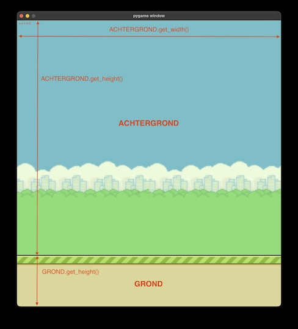

# Flappy Bird

## Intro

## Stap 0: Afbeeldingen

Voor dit spel heb je een aantal afbeeldingen nodig. Maak een mapje met de naam `afbeeldingen` en download daar in de volgende afbeeldingen:
- https://raw.githubusercontent.com/Coderdojo-Gent/cdj-python/master/flappy-bird/afbeeldingen/achtergrond.png
- https://raw.githubusercontent.com/Coderdojo-Gent/cdj-python/master/flappy-bird/afbeeldingen/buis.png
- https://raw.githubusercontent.com/Coderdojo-Gent/cdj-python/master/flappy-bird/afbeeldingen/grond.png
- https://raw.githubusercontent.com/Coderdojo-Gent/cdj-python/master/flappy-bird/afbeeldingen/vogel-midden.png
- https://raw.githubusercontent.com/Coderdojo-Gent/cdj-python/master/flappy-bird/afbeeldingen/vogel-omhoog.png
- https://raw.githubusercontent.com/Coderdojo-Gent/cdj-python/master/flappy-bird/afbeeldingen/vogel-omlaag.png

## Stap 1: Achtergrond

We starten met de basis code voor een spel met PyGame:

```python
import pygame

VENSTER_BREEDTE = 100
VENSTER_HOOGTE = 100

pygame.init()

venster = pygame.display.set_mode((VENSTER_BREEDTE, VENSTER_HOOGTE))

while True:
    # Stop het programma als de speler op het kruisje klikt
    for event in pygame.event.get():
        if event.type == pygame.QUIT:
            pygame.quit()

    pygame.display.update()
```

In deze eerste stap willen we:
1. De achtergrond (`afbeeldingen/achtergrond.png`) en de grond (`afbeeldingen/grond.png`) laten zien in het venster
2. Het venster even groot maken als de achtergrond

Met Pygame kan je een afbeelding inleze met de functie `pygame.image.load("waar/is/de/afbeelding.png")`. Het resultaat van die functie willen we in een variable steken zodat we die later kunnen gebruiken. Bvb:

```python
# In de variable ACHTERGROND zit de afbeelding van de achtergrond
ACHTERGROND = pygame.image.load("afbeeldingen/achtergrond.png")
```

Om een ingelezen afbeelding in het venster de laten zien gebruiken we de functie `venster.blit(afbeelding_variabele, (x, y))`. Hierbij zijn x en y de coordinaten van de linkerbovenhoek van de afbeelding. Bvb

```python
# Toon de afbeeldingen in de variable ACHTERGROND in de positie x=0, x=y van het venster
venster.blit(ACHTERGROND, (0, 0))
```

Probleem: het venster van ons programma is veel te klein voor de achtergrond! Dit kunnen we oplossen door de hoogte en breedte van het venster precies even groot te maken (in plaats van `100`) als de afbeelding van de achtergrond. Met `ACHTERGROND.get_width()` krijgen we de breedte van de afbeelding en met `ACHTERGROND.get_height()` de hoogte.

Onder de achtergrond willen we de afbeelding van de grond. Dat betekend dat we:
- De `VENSTER_HOOGTE` moet gelijk zijn aan de hoogte van de `ACHTERGROND` + de hoogte van de `GROND`.
- Als we `venster.blit()` gebruiken om de `GROND` af te beelden met de y-waarde gelijk zijn aan de hoogte van `ACHTEGROND`.

Uiteindelijk moet het er zo uit zien:



## Stap 2: Grond Laten Scrollen

De speler moet de indruk krijgen dat het vogeltje (dat we in een volgende stap pas toevoegen) naar rechts vliegt. Dat kunnen we doen door de grond naar links de laten bewegen.

Dit kunnen we doen door in de `while` lus telkens de x coordinaat van de grond een klein beetje kleine de maken. De grond afbeelding schuift dan naar links. Dus in plaats van een vaste x waarde van `0` gebruiken we een nieuwe variabele, bvb.  `grond_x`. Om te beginnen (voor de `while` lus) is die gelijk aan `0` en in de lus doen we er telkens bvb. `5` af.

Probleem: de afbeelding van de grond blijft voor altijd naar links schuiven. Om dat op te lossen kunnen we het volgende doen: als de rechterkant van de grond voorbij de rechterkant van het venster komt zetten we de afbeelding terug in de start positie, namelijk `grond_x = 0`. We moeten code schrijven die het volgende doet:

ALS `grond_x` + grond breedte KLEINER OF GELIJK is dan `VENSTER_BREEDTE` DAN `grond_x = 0`.

Als dit gelukt is zou je de grond moeten zien bewegen naar links. Maar er is een nieuw probleem: de grond beweegt veel te snel. Dat is omdat Python de code in the `while` lus zo snel mogelijk probeert uit te voeren. We hebben een klok nodig zodat we de code in the lus een bepaald aantal keer per seconde (bvb. 60) uitvoeren. Dat kunnen we doen met Pygame:
- Met `klok = pygame.time.Clock()` maken we een nieuwe variabele `klok` en dat is een Pygame klok. Die doen we 1 keer voor de lus
- Met `klok.tick(60)`, _in_ de lus, zorgen we dat die maar 60 keer per seconde uitvoert

Je kan ook andere waarden dan `60` proberen.

## Stap 3: De Vogel

Weet je al wat een klasse is?

Een klasse ("class" in het Engels) is als een bouwtekening voor iets dat je in de computer wilt maken. Stel je voor dat je een auto wilt bouwen in een computerspel. In plaats van steeds opnieuw te bedenken hoe een auto werkt, maak je één keer een bouwplan (de class) en daarna kun je zoveel auto’s maken als je wilt! Zo 1 auto heet dan een _object_. Je kan dus veel objecten maken van eenzelfde klasse.

Je gebruikt al klassen zonder dat je het weet! Zo is in ons programma `klok` een object van de klasse `Clock`.

In Python kan je ook een nieuwe klasse maken die een uitbreiding is op een andere klasse. Die nieuwe klasse kan dan alles wat de andere klasse kan. We zeggen dan dat die nieuwe klasse een _subklasse_ is van de andere.

In PyGame hebben we de klasse `pygame.sprite.Sprite`. Die gaan we gebruiken! Een Sprite is een afbeelding of figuur in een game die kan bewegen en met andere sprites kan botsen. Voor onze game gaan we een aantal subklassen maken van `Sprite`, en we beginnen met een klasse voor de vogel.

Voor die eerste klasse krijg je de volledige code met extra uitleg. Probeer wel alles te snappen want in de volgende stappen zul je het zelf moeten doen!

```python
class Vogel(pygame.sprite.Sprite):
    # __init__ is een speciale functie die een nieuw object maakt
    def __init__(self, x, y):
        # Eerste gebruiken we de __init__ functie van the Spite klasse
        pygame.sprite.Sprite.__init__(self)
        # Dan laden we de afbeelding van de vogel in
        self.image = pygame.image.load("afbeeldingen/vogel-midden.png")
        # Pygame heeft een rechthoek (rectangle) nodig om te weten waar
        # de sprite geplaatst moet worden
        self.rect = self.image.get_rect()
        # De x en y coordinaten gebruiken we om het midden van de rechthoek te bepalen
        self.rect.center = (x, y)
```

Sprites kunnen we niet rechtstreeks gebruiken. Elke Sprite moet eerst een een "sprite groep" geplaatst worden. Voor onze vogel hebben we natuurlijk maar 1 sprite nodig want er is maar 1 vogel.

De volgende code maakt een Vogel sprite, en een sprite group met die Vogel sprite er in. Als we een `Vogel` maken moeten we de x en y coordinaten voor het midden van de vogel ingeven. We proberen `x = 100` (een klein beetje weg van de linkerkant) en `y = VENSTER_HOOGTE // 2` (verticaal in het midden).

```python
# Maak een Vogel en plaats hem in een nieuwe sprite groep
vogel = Vogel(100, VENSTER_HOOGTE // 2)
vogel_groep = pygame.sprite.Group()
vogel_groep.add(vogel)
```

Nu moeten we enkel nog in the `while` lus telkens de `vogel_groep` tekenen (= "draw"). In de `draw()` functie moeten we meegeven _waar_ de groep in getekend moeten worden (in het venster!). Dat moeten we doen _na_ dat we de achtergrond getekend hebben.

```python
# Teken de vogel_groep in het venster
vogel_groep.draw(venster)
```

Als alles goed is die je nu links in het midden een vogel. Hij beweegt alleen nog niet...

## Stap 4: Vogel Laten Vliegen

Om te beginnen zorgen we er voor dat de vogel naar beneden valt. Na als in het echt willen we dat hou langer iets valt hoe sneller het gaat.

Onze vogel zal dus een `snelheid` moeten hebben. Dat stelt dan de snelheid voor waarmee de vogel naar beneden valt (en straks ook naar boven vliegt).

Als het programma start zal de snelheid `0` zijn. De snelheid kunnen we bijhouden in onze `Vogel` klasse. De startwaarde, 0, stellen we in de `__init__()` functie in.

```python
class Vogel(pygame.sprite.Sprite):
    def __init__(self, x, y):
        # Bestaande code
        self.snelheid = 0
```

Nu gaan we een extra functie toevoegen aan de klasse:  `update()`. Die wordt automatisch aangeroepen voor elke Sprite in een groep als de functie met dezelfde naam wordt aangeroepen op de groep. In die functie moeten we 2 dingen doen:
1. De `snelheid` verhogen, bvb met `0.5` (hoe groter dit getal, hoe sneller de vogel valt!).
2. De `y` waarde van de sprite verhogen met de `snelheid`. Dan kan je doen met `self.rect.y += int(self.snelheid)`. We moeten `int()` gebruiken omdat de y-waarde geen kommagetal mag zijn.

Probeer zelf de functie toe te voegen.

We moeten nu ook nog `update()` aanroepen voor de `vogel_groep`. Daarvoor gebruiken we `vogel_groep.update()` en dat doen we net voor we de `draw()` functie gebruiken.

Als je nu test valt de vogel direct naar beneden, door de grond heen (dat lossen we in een verdere stap op!).

Nu moeten de vogel ook nog naar omhoog laten vliegen. Bvb. als de speler de spatiebalk indrukt. Eerste breiden we onze `update` functie de de `Vogel` klasse uit. We voegen een parameter toe aan de functie: `def update(self, vlieg_omhoog=False):`. Als we gewoon `update()` gebruiken zoals we nu al doen zal `vlieg_omhoog` `False` zijn. Als de spatiebalk is ingedrukt zullen we `update(vlieg_omhoog=True)` aanroepen.

We moeten:
1. De `update()` functie aanpassen. Als `vlieg_omhoog=True` maken we de `snelheid` een negatief getal (bvb. `-10`). Op die manier 'springt' de vogel omhoog.
2. In de `for event in pygame.event.get():` lus checken of de spatiebalk indrukt is. Als dat zo is roepen we `update(vlieg_omhoog=True)` aan.

Checken of the spatiebalk is ingedrukt kan met volgende code:

```python
if event.type == pygame.KEYDOWN:
    if event.key == pygame.K_SPACE:
        # Wat willen we hier doen?
```

Als alles gelukt is kan je nu met de spatiebalk de vogel omhoog laten vliegen. Doe je niets, dan valt hij naar beneden!

## Stap 5: Buizen

In deze stappen voegen we de buizen toe waar onze vogel doorheen moet proberen vliegen. In afbeeldingen hebben we hiervoor `buis.png`. Dat is een buis met de opening naar boven.

Voor de buizen gaan we precies hetzelfde te werk als voor de vogel: we maken een nieuwe klasse: `Buis`, die een subklasse is van `pygame.sprite.Sprite`. Voor de plaats van de buis gebruiken we de x,y coordinaten dit keer niet in `self.rect.center` maar in `self.rect.topleft`. Dat is de linker bovenhoek van de buis.

Net als bij de vogel moeten we nu een `buis` (`= Buis()`) en een `buis_groep` (`= pygame.sprite.Group()`) maken, en dan de `buis` toevoegen aan de groep. Voor de x,y coordinaten van de `Buis` kan je starten met `300, VENSTER_HOOGTE // 2`. `300` is horizontaal een beetje verder dan de vogel, en `VENSTER_HOOGTE // 2` is nog steeds het midden van het venster.

Nu moeten we, net als bij de `vogel_groep`, de `buis_groep` nog updaten `update()` en tekenen `draw()`. Dat komt in de `while` lus voor of na dezelfde functies op de `vogel_groep`.

Als dit werkt hebben we een buis onderaan. We moeten ook nog een buis bovenaan hebben, en een kleine opening tussen de 2 buizen waar je door moet vliegen. Voor de buis bovenaan hebben we geen extra afbeelding nodig - we kunnen dezelfde afbeelding gebruiken en omdraaien! Dat kan met `self.image = pygame.transform.flip(self.image, False, True)`.  Om te bepalen of we de afbeelding wel of niet willen flippen voegen we een parameter toe aan de `__init__()` functie: `__init__(self, x, y, flip=False)`. Als `flip=True` dan flippen we de afbeelding. We gaan dan ook een ander punt gebruiken voor de x,y coordinaat, namelijk de linker onderkant: `self.rect.bottomleft`

We willen het volgende resultaat krijgen:


We zullen nu dus _twee_ buizen moeten maken en beide in de `buis_groep` toevoegen. Als we beide buizen de y-waarde `VENSTER_HOOGTE // 2` geven zullen ze tegen elkaar plakken. Om een opening te krijgen kunnen we de grootte van de opening (bvb. 150 pixels) aftrekken bij de bovenste buis: `VENSTER_HOOGTE // 2 - 150`.

Als allerlaatse in deze stap will we er ook voor zorgen dat de buizen naar links bewegen zodat de vogel er tussen kan vliegen. Dat kunnen we doen met een extra `update()` functie in de `Buis` klasse die op dezelfde manier werkt als hoe we de grond naar links laten bewegen.

## Stap 6: Automatisch Nieuw Buizen

In de vorige stap hebben we een eerste paar buizen gemaakt die automatisch naar links bewegen. Maar het is natuurlijk de bedoeling dat er steeds nieuwe buizen bijkomen van de rechterkant van het scherm.

We zouden bvb. elke 1,5 seconden een nieuw paar buizen willen toevoegen in de `buis_groep` en deze helemaal rechts van het scherm laten starten. We kunnen de functie `pygame.time.get_ticks()` gebruiken om de tijd op dat moment te weten. We vragen dan eigenlijk aan pygame: _hoe laat is het nu heel precies?_ Het resultaat is een getal in miliseconden (1 seconde = 1000 miliseconden). Als we dan in een variable , bvb. `laatste_buis` onthouden wanneer we de laatste keer een buis hebben toegevoegd kunnen we telkens kijken of er al 1.5 seconden (= 1500 miliseconden) voorbij zijn. Als dat zo is maken we nieuwe buizen en maken we `laatste_buis` gelijk aan de huidige tijd.

Het ziet er ongeveer zo uit:

```python
# Buiten de while lus:
laatste_buis = pygame.time.get_ticks()
buis_interval = 1500
buis_groep = pygame.sprite.Group()

# In de lus, voordat we de buis_group tekenen.
# We gebruiken VENSTER_BREEDTE voor de x waarde om helemaal rechts te beginnen
if pygame.time.get_ticks() >= laatste_buis + buis_interval:
     buis_onder = Buis(VENSTER_BREEDTE, VENSTER_HOOGTE // 2)
     buis_boven = Buis(VENSTER_BREEDTE, VENSTER_HOOGTE // 2 - 150, flip=True)
     buis_groep.add(buis_onder)
     buis_groep.add(buis_boven)
     laatste_buis = pygame.time.get_ticks()
```

Probleem 1: elke 1,5 seconden maken we een nieuw paar buizen, maar de buizen worden nooit verwijderd. Als de buizen links uit het scherm verwdijnen zien we ze niet meer, maar ze bestaan wel nog. We moeten de buizen die niet meer te zien zijn dus wissen! Wat we kunnen doen is in de `update()` functie van de `Buis` klasse controleren of de x-waarde van de rechterkant van de buis (`self.rect.right`) kleiner is dan 0. Als dat zo is kunnen we die Buis (Sprite) wissen, met de functie `self.kill()`

Probleem 2: alle buizen hebben op precies dezelfde plaats een opening om door te vliegen. Dat zal snel saai worden. We willen dat de opening op een willekeurige (random) plaats komt. Eerst moeten we de `random` module bovenaan ons programma importeren. Eerst bepalen we het midden van de achtergrond: `midden = ACHTERGROND.get_height() // 2`. Dan laten we het programma het midden van de opening tussen de buizen kiezen: een random getal dat maximum 200 pixels boven of onder het midden van de achtergrond ligt: `buis_midden = random.randrange(midden - 200, midden + 200)`. De opening tussen de buizen moet 150 pixels zijn, dus de onderste buis komt 75 pixels onder `buis_midden` en de bovenste 75 pixels erboven. Probeer zelf `buis_onder` en `buis_boven` aan te passen zodat dit klopt.

## Stap 7: Game Over bij Botsingen

We hebben een vogel die kan vliegen en buizen die op ons afkomen. Alleen kunnen we nu nog gewoon tegen de buizen aanvliegen. Dat gaan we nu aanpassen!

Pygame heeft een handige functie die kan controleren of twee sprite groepen met elkaar botsen (= colliden): `pygame.sprite.groupcollide(eerste_groep, tweede_group, False, False)`. We kunnen die functie gebruiken op het einde van de `while` lus met een `if`. ALS de `vogel_groep` en de `buis_groep` botsen, DAN moet het volgende gebeuren:
- Alle buizen in de `buis_groep` verwijderen: `buis_groep.empty()`
- De x en y waardes van de `vogel` terug op de start-positie zetten: `vogel.rect.x = 100`, `vogel.rect.y = VENSTER_HOOGTE // 2`

Nu herstart het spel als de vogel tegen een buis botst. Hetzelfde moet nog gebeuren als de vogel tegen de grond botst, of boven uit het beeld zou verdwijnen. Probeer zelf uit te zoeken hoe je deze twee situaties kan controleren en voeg de juiste voorwaarden toe aan de `if` conditie.

## Stap 8: Flapperen

Tijdens het vliegen blijft de vogel er altijd hetzelfde uitzien en dat is een beetje saai. We hebben tot nu toe enkel de afbeelding `vogel-midden.png` gebruikt maar we hebben ook nog `vogel-omhoog.png` en `vogel-omlaag.png`. Als we de afbeelding die gebruikt wordt in de `Vogel` klasse (= `self.image`) kunnen laten afwisselen tussen de 3 verschillende afbeeldingen dan zal het lijken alsof de vogel fladdert!

Eerst moeten zorgen dat de `Vogel` klasse alle afbeeldingen inlaad, in the `__init__()` functie:

```python
        afbeeldingen = [
            pygame.image.load("afbeeldingen/vogel-omhoog.png"),
            pygame.image.load("afbeeldingen/vogel-midden.png"),
            pygame.image.load("afbeeldingen/vogel-omlaag.png"),
        ]
```

Dan gebruiken we een handige Python functie, `self.flapper_cycle = itertools.cycle(afbeeldingen)` (hiervoor moeten we eerste de `itertools` module importeren). Als we nu `next(self.flapper_cycle )` gebruiken krijgen we steeds de 'volgende' afbeelding in the `afbeeldingen` lijst. Als we op het einde van de lijst komen beginnen we automatisch terug vooraan. Voor `self.image` kunnen we dus een eerste keer `next(self.flapper_cycle)` gebruiken.

Dan breiden we de `update()` functie van de `Vogel` klasse verder uit. We voegen een extra parameter, `flapper=False`. ALS `flapper` `True` is, DAN gebruiken we `next(self.flapper_cycle)` om `self.image` te updaten.

Nu moeten we enkel nog in de `while` lus regelmatig `vogel_groep.update(flapper=True)` aanroepen. Hiervoor gebruiken we dezelfde aanpak als voor het aanmaken van nieuwe buizen. We krijgen dus een `flapper_tijd` en `flapper_interval`, die we startwaarden moeten geven _voor_ de lus. Een goed begin voor `flapper_interval` is `100`, dan zal de vogel 10 keer per seconde (want 100 miliseconden past 10 keer in 1 seconde) flapperen. _In_ de lus moeten we nu net voordat we de `vogel_groep` tekenen controleren of `pygame.time.get_ticks() >= flapper_tijd + flapper_interval`. Als dat zo is doen we `vogel_groep.update(flapper=True)` en zetten we `flapper_tijd = pygame.time.get_ticks()`.

Als het goed is moet de vogel nu flapperen. Je kan andere waarden testen voor `flapper_interval` en gebruiken wat je zelf het leukst vindt.

## Stap 9: Spel starten met spatie

Ons spel is nu zeker al speelbaar, maar er zijn nog een paar handige en leuke verbeteringen mogelijk. Zo is het nu niet echt handig dat het spel onmiddelijk start (en herstart na een botsing). Wat we willen is dat het spel opstart maar de vogel pas begint te vliegen nadat we een eerste keer de spatiebalk indrukken.

We kunnen nog een extra variable toevoegen, bvb `start`. Voordat de `while` lus begint zetten we de waarde op `False`. Zolang de waarde `False` blijft willen we de `vogel_groep` nog niet updaten en nog geen buizen toevoegen of laten bewegen. We krijgen dus code die er ongeveer zo uit ziet:

```python

# Vogen en Buizen updates enkel nadat spel gestart is:
if start:
    # code om buizen toevoegen
    vogel_groep.update()
    buis_groep.update()

# Vogel en Buizen moeten we altijd getekend worden:
vogel_groep.draw(venster)
buis_groep.draw(venster)
```

Nu moeten we enkel nog `start = True` maken als de spatiebalk de eerste keer wordt ingedrukt. Probeer dit zelf te doen.

Als laatste moeten we terug `start = False` maken na een botsing.

## Stap 10: Score

Als laatste stap willen we nog graag een score laten zien voor hoeveel buizen de vogel is doorgevlogen.

We maken alvast een aantal extra variabelen aan voor dat de `while` lus start:

```python
# Om te controleren of the vogel precies tussen de buizen zit
vliegt_door_buis = False

# Het lettertype en de kleur van de tekst voor de score te laten zien
font = pygame.font.SysFont("Bauhaus 93", 60)
wit = pygame.Color("white")

# Om te score bij te houden
score = 0
```

Om te weten wanneer de vogel _door_ de buizen gevlogen is gebruiken we volgende logic:
- ALS
  - De vogel nog niet tussen de buizen zit (`not vliegt_door_buis`), EN
  - De buizen groep is niet leeg (`buis_groep.has()`), EN
  - De x-waarde van het midden van de vogel (`vogel_groep.sprites()[0].rect.x`) ligt tussen de linkerkant van de eerste buis (`buis_groep.sprites()[0].rect.left`) en de rechterkant van de eerste buis `buis_groep.sprites()[0].rect.right`
- DAN
  - Maak `vliegt_door_buis = True`

- ALS
  - De vogel tussen de buizen is geweest (`vliegt_door_buis`), EN
  - De buizen groep is niet leeg (`buis_groep.has()`), EN
  - De x-waarde van het midden van de vogel (`vogel_groep.sprites()[0].rect.x`) is groter dan de rechterkant van de eerste buis `buis_groep.sprites()[0].rect.right`
- DAN
  - Maak `vliegt_door_buis = False`
  - Maak de score 1 groter (`score += 1`)

Je krijgt de juiste code hiervoor maar probeer wel de logica te snappen! Volgende code moet komen in de lus binnen in de `if start:` (and we willen dit enkel controlleren als het spel gestart is).

```python
if (
    not vliegt_door_buis
    and buis_groep.has()
    and buis_groep.sprites()[0].rect.left
    < vogel_groep.sprites()[0].rect.x
    < buis_groep.sprites()[0].rect.right
):
    vliegt_door_buis = True
if (
    vliegt_door_buis
    and buis_groep.has()
    and vogel_groep.sprites()[0].rect.x > buis_groep.sprites()[0].rect.right
):
    vliegt_door_buis = False
    score += 1
```

Dan moeten we nog de score afbeelden op het venster:

```python
venster.blit(font.render(str(score), True, wit), (int(VENSTER_BREEDTE // 2), 20))
```

Als laatste moeten we natuurlijk ook nog de score terug op 0 zetten na een botsing! (`score = 0`)

Kan je nog andere verbeteringen bedenken?

## Refs

- https://github.com/russs123/flappy_bird/blob/main/flappy.py
- https://www.youtube.com/watch?v=GiUGVOqqCKg&list=PLjcN1EyupaQkz5Olxzwvo1OzDNaNLGWoJ
- https://github.com/LeonMarqs/Flappy-bird-python/tree/master?tab=readme-ov-file
