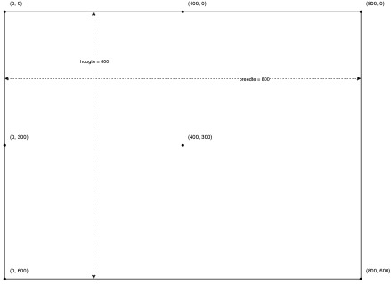
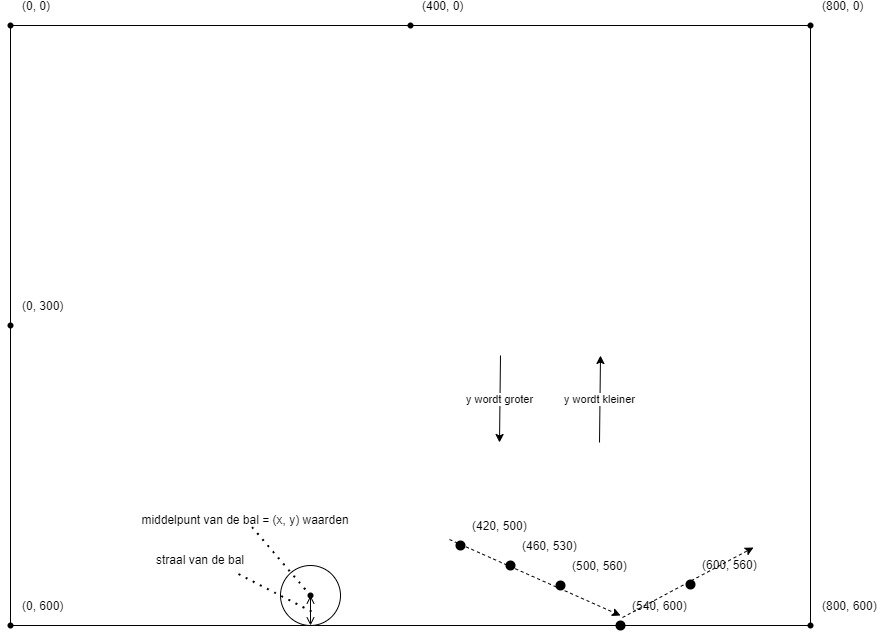
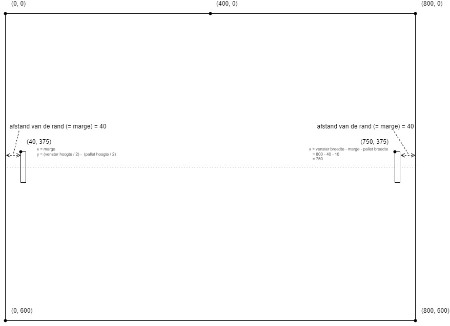

# Pong

* Level: 3 - Vergevorderd
* Onderwerpen: pygame, lussen, constanten, wiskunde

In deze opdracht maken we een eenvoudige versie van het computerspel Pong.

## De Spelregels

https://nl.wikipedia.org/wiki/Pong

Pong is een van de eerste computerspellen uit 1972! Pong is gebaseerd op tafeltennis (of pingpong). Het spel werkt met twee paletten (of batjes), een balletje en twee muren aan de zijkant. De bedoeling van het spel is dat het balletje achter het palet van de tegenspeler terechtkomt. In dat geval wordt een punt gescoord. De score verschijnt bovenin het scherm. Er wordt een bepaalde tijd gespeeld of het er wordt gespeeld tot een speler een bepaald aantal punten,bvb 10 punten, heeft gescoord.


## Stap 0: Pygame

Bekijk de [Snake opdracht](../snake/pygame%20cursus.pdf). Daar vind je een inleiding over Pygame en uitleg hoe je het moet installeren.

## Stap 1: Het Speelveld en de Pygame "event loop"

De module `pygame` moeten we bovenaan ons programma eerste "importeren".

Pygame moet je daarna ook nog eens "inladen". Dat doe je met de functie `pygame.init()`.

Om een venster te maken gebruiken we de functie `pygame.display.set_mode((breedte, hoogte))`. Voor ons spel hebben we maar 1 venster nodig. Voor de "breedte" gebruiken we 800 (pixels) en voor de hoogte 600. Zo krijgen we een rechthoekig venster. Het resultaat van die functie hebben we later nog nodig, dus we moet die opslaan in een variable. Die noemen we bvb. gewoon `venster`.

Om spellen met Pygame te maken gebruiken een `while` lus. Die lus stop pas als de variabele `stoppen` `True` wordt. Dat doen we in de lus als we zien dat de speler wil stoppen (bvb door het venster te sluiten of op een bepaalde toets te duwen).

In die `while` lust gebruiken we een tweede lus. Een `for` lus. Daarmee bekijken we alle gebeurtenissen (`event`s) die er zijn geweest. Een gebeurtenis is bvb. een toets die wordt ingedrukt of de muis die beweegt. Als we zien dat een van die gebeurtenissen `pygame.QUIT` is, dat is waneer het venster wordt gesloten, maken we de variable `stoppen` `True` zodat het programma stopt. Dit stukje code ziet er bvb zo uit:

```python
stoppen = False
while not stoppen:
    # Bekijk alle events (gebeurtenissen)
    for event in pygame.event.get():
        print(event)

        # De event "pygame.QUIT" krijgen we als het venster wordt gesloten
        if event.type == pygame.QUIT:
            stoppen = True
```

We willen ons speelveld (= het volledige venster) ook helemaal zwart maken. Dat doen we met de functie `venster.fill((0, 0, 0))`. Die functie moet ook in dezelfde `while` lus komen. Daarna moeten we Pygame ook nog de instructie geven om alle verandering (tot nu toe is dat enkel het vullen van het venster met een kleur) bij te werken. Dat doen we met de functie `pygame.display.update()`.

`(0, 0, 0)` is de _RGB kleurcode_ voor zwart. Op de website https://www.google.com/search?q=google+color+picker kan je kleuren kiezen en de RGB code aflezen. Als je wil kan je ook een ander kleur dan zwart proberen.

## Step 2: Constanten, coördinaten en het balletje

Waarden zoals kleurcodes en de hoogte en breedte van het venster zullen we meer dan 1 keer nodig hebben in ons programma. We kunnen fouten vermijden en ons programma duidelijker maken door die waarden 1 keer in een variabele te steken en dan enkel die variabele te gebruiken. Een variable waarvan de waarde nooit zal veranderen noemen we een _constante_ en schrijven we met `HOOFDLETTERS`. Voeg de volgende code toe bovenaan je programma (net na de `import`) en vervang dan overal waarden met de naam van de juiste constante.

```python
VENSTER_HOOGTE = 600
VENSTER_BREEDTE = 800

KLEUR_ZWART = (0, 0, 0)
```

Nu willen we een balletje tekenen. Het zal een andere kleur moeten hebben dan de achtergrond. Kies een kleur en voeg die alvast toe aan de constanten. Bvb. `KLEUR_WIT = (255, 255, 255)`.

Een _coördinaat_ is een getal waarmee we de plaats van een bepaald punt in ons speelveld kunnen voorstellen. We hebben altijd een _X-coördinaat_ en een _Y-coördinaat_. De X bepaalt de horizontale positie (de breedte) en de Y bepaalt de verticale positie (de hoogte). X-Y coördinaten schrijven we als `(x, y)`. De linker-bovenhoek van het veld is altijd `(0, 0)`. Als we weten dat ons veld `800` breed is, dan weten we dat de rechter-bovenhoek `(800, 0)` is. Precies het midden van het veld kunnen we berekenen door de breedte en de hoogte te delen door 2. Dan krijgen we ... `(400, 300)`.



Het balletje is eigenlijk een gevulde cirkel. Om die te tekenen gebruiken we de volgende functie:

```python
pygame.draw.circle(venster, kleur, [x, y], diameter)
```

* `venster` is de naam (variable) van het venster waarin we willen tekenen. In ons geval dus gewoon `venster`.
* `kleur` is kleurcode voor de kleur die willen. Bvb. `(255, 255, 255)`, of de naam van onze constante met de juiste kleur.
* `x` en `y` zijn de getallen van de coördinaten voor het midden van de cirkel. Kies zelf de getallen die je wil. Het eerlijkst voor beide spelers is als de bal start in het midden van het speelveld!
* `diameter` is een getal voor de diameter van de cirkel. Dus hoe groot de bal zal zijn. Probeer maar verschillende getallen en kies wat je zelf goed vindt.

## Stap 3: Bal laten bewegen

Om de bal te doen bewegen moeten we eigenlijk de bal telkens opnieuw tekenen maar iets "verder" dan de vorige plaats. Met andere woorden met telkens iets andere x en y coördinaten.

We zullen dus variabelen nodig hebben om de coördinaten in bij te houden zodat we ze in de while-lus telkens een beetje kunnen aanpassen.

Voor de start-waarden van onze coördinaten gebruiken we hetzelfde als in stap 2, namelijk het midden van het speelveld.

```python
bal_x = 400
bal_y = 300
```

We kunnen Python dit ook voor ons laten berekenen, zodat we niets moeten veranderen als we ooit een groter of kleiner speelveld willen:

```python
bal_x = int(VENSTER_BREEDTE / 2)
bal_y = int(VENSTER_HOOGTE / 2)
```

Vervang nu de x en y waarden in je `pygame.draw.circle` functie met de nieuwe variabelen. Als het goed is staat de bal nu nog steeds in het midden.

Nu moeten we in de while-lus de x en y variabelen telkens een beetje aanpassen. We kunnen bvb. telkens `2` bij de huidige waarde optellen. Die `2` is dan eigenlijk de _snelheid_ van de bal. Met een groter getal zal de bal sneller bewegen. Omdat we de snelheid later waarschijnlijk zullen moeten aanpassen stoppen we die best ook in een variable. Een variabele voor de `x` en een voor de `y`.

```python
bal_x_snelheid = 2
bal_y_snelheid = 2
```

In de while-lus kunnen we nu zorgen dat `bal_x` vermeerderd wordt met `bal_x_snelheid`, en hetzelfde voor de `y`.

Als we de code nu testen merken we nog een klein probleempje: de bal gaat veel te snel. Dat komt omdat we in onze while-lus nooit wachten. Python voert alles zo snel mogelijk uit. Pygame heeft hier een oplossing voor. Een special klok. Met die klok kunnen we er voor zorgen dat de lus nooit meer dan 60 keer per seconde uitgevoerd wordt. Dat is een normale snelheid voor computergames zodat we als speler eigenlijk niet merken dat er tussen elk beeld even wordt gewacht.

Buiten de while-lus moeten we eerst zo een speciale klok aanmaken:

```python
clock = pygame.time.Clock()
```

Dan kunnen we zorgen dat die klok 60 keer per seconde "tikt" met de volgende functie, helemaal op het einde van de while-lus:

```
clock.tick(60)
```

## Stap 4: Bal laten botsen

We moeten er voor zorgen dat de bal bots als hij de rand van het speelveld raakt.

De bal heeft een bepaalde "snelheid" in the x-richting, en in de y-richting. Als we starten is die snelheid bvb `2` voor x en voor y. Dus de x en y waarden van de bal vermeerderen telkens met 2.



Als de bal de onderste rand van het veld raakt kunnen we de y waarde dus eigenlijk niet meer vermeerderen. Vanaf dan moeten we de y waarde terug verkleinen (met 2), zodat de bal terug naar boven gaat.

Hoe weten we nu of de bal de onderstand rand raakt? De x en y waarden van de bal zijn voor het _midden_ van de bal. De rand van de bal raakt dus de onderste rand van het veld als de y waarde van de bal + de straal van de bal gelijk (of groter) zijn van de totale hoogte van het veld.

De straal van de bal is de helft van de diameter van de bal. En de diameter van de bal, bvb `10`, is de laatste waarde die we gebruikten in de `pygame.draw.circle` functie. Omdat we die waarde een aantal keer nodig zullen hebben is het handig als we die ook even in een constante stoppen. Voor de hoogte van het veld hadden we al een constante: `VENSTER_HOOGTE`.

Om te testen of de bal de onderste rand raakt kunnen we dan volgende code gebruiken:

```python
# Bovenaan ons programma bij de andere constanten:
BAL_DIAMETER = 10
BAL_STRAAL = int(BAL_DIAMETER / 2)

# In de while-lus, voordat we de volgende waarde van bal_x en bal_y berekenen:
if bal_y + BAL_STRAAL >= VENSTER_HOOGTE:
    # Wat moeten we nu doen?
```

Wat moeten we nu doen als de bal de rand raakt? De y-snelheid van de bal aftrekken i.p.v. op te tellen. Dat kunnen we doen door het teken van de y-snelheid om te draaien: als het `2` was moet het `-2` worden, en als het `-2` moet het `2` worden. Dat kan gemakkelijk de te vermenigvuldigen met `-1`.

Immers: `2 * -1 = -2` en `-2 * -1 = 2`.

Of in Python code: `bal_y_snelheid = bal_y_snelheid * -1`

Probeer nu zelf de code aan te vullen zodat de bal ook botst op de 3 andere randen van het veld! Als resultaat moet je een venster krijgen met een bal die oneindig blijft botsen.

## Stap 5: De paletten tekenen en laten bewegen

Om de bal te tekenen gebruikten we de functie `pygame.draw.circle`. Voor de paletten tekenen een rechthoek, en dat doen we met de functie `pygame.draw.rect`.

Die functie heeft 3 argumenten:
1. Het `venster` waarin de rechthoek moet komen (net zoals bij `circle`)
2. De kleurcode (net zoals bij `circle`)
3. Een `pygame.Rect`

Die `pygame.Rect` is opnieuw een functie, met 4 argumenten:
1. De x coördinaat van de linker-bovenhoek
2. De y coördinaat van de linker-bovenhoek
3. De breedte van de rechthoek
4. De hoogte van de rechthoek

Alles samen krijgen we zoiets:

```python
pygame.draw.rect(venster, KLEUR_WIT, pygame.Rect(100, 200, 10, 50))
```

Als je deze code test dan zie je een witte rechthoek die 10 pixels breed en 50 hoog is, met de linker-bovenhoek op positie x=100, y=200.

Nu moeten eerst nadenken waar we precies de rechthoeken voor onze 2 paletten willen teken...



Voor de verticale positie van de paletten (dus de y waarde) willen we voor alle 2 dat ze starten in het midden van het spelveld. Het midden kunnen we dankzij onze constanten gemakkelijk berekenen: `(VENSTER_HOOGTE / 2)`. Maar de y-waarde die we nodig hebben is de linker-bovenhoek. Dus moeten we ook nog de helft van de hoogte van de rechthoek aftrekken. We gebruiken weeral een nieuwe constante om de hoogte van de rechthoeken/paletten in op te slaan.

Let op: na een deling geeft Python als resultaat een kommagetal (in Python: een `float`). Maar voor `pygame.Rect` hebben we gehele getallen (in Python: een `int`) nodig. We moet het resultaat dus terug omzetten naar een `int`.

```python
PALET_HOOGTE = 50

# Start positie voor palet 1
palet_1_y = int(VENSTER_HOOGTE/2 - PALET_HOOGTE/2)

# Start positie voor palet 2
palet_2_y = int(VENSTER_HOOGTE/2 - PALET_HOOGTE/2)
```

Voor de horizontale positie van de paletten (dus de x waarde) willen we voor alle 2 dat ze altijd op een bepaalde afstand van de rand blijven. Zo een afstand heet een _marge_. Bvb. 40 pixels. Je raadt het al, daar gaan we weer een constant voor gebruiken.

We moeten opnieuw goed opletten dat de x waarde die we nodig hebben die van de linker-bovenhoek van het palet is.

Voor het linkse palet is dat dus precies die marge.

Voor het rechtste palet starten we met de volledige breedte van het venster. Daar moeten we de marge van aftrekken. En daarvan moeten we dan ook nog eens de breedte van het palet aftrekken.

```python
PALET_HOOGTE = 50
PALET_BREEDTE = 10
PALET_MARGE = 40

# Start positie voor palet 1
palet_1_x = PALET_MARGE
palet_1_y = int(VENSTER_HOOGTE/2 - PALET_HOOGTE/2)

# Start positie voor palet 2
palet_2_x = VENSTER_BREEDTE - PALET_MARGE - PALET_BREEDTE
palet_2_y = int(VENSTER_HOOGTE/2 - PALET_HOOGTE/2)
```

Probeer nu zelf de code voor de `pygame.draw.rect` functie in te vullen. We moeten 2 paletten tekenen, dus we zullen de functie 2 keer moeten gebruiken.

Om de paletten te laten bewegen, moeten we een nieuw event toevoegen aan de eventloop.

```
while not stoppen:
    # Bekijk alle events (gebeurtenissen)
    for event in pygame.event.get():
        print(event)

        # Hoe de paletten laten bewegen
        if event.type == pygame.KEYDOWN:
          if event.key == pygame.K_a:
              palet_1_y += 10
          if event.key == pygame.K_q:
              palet_1_y -= 10
          if event.key == pygame.K_DOWN:
              palet_2_y += 10
          if event.key == pygame.K_UP:
              palet_2_y -= 10
```
